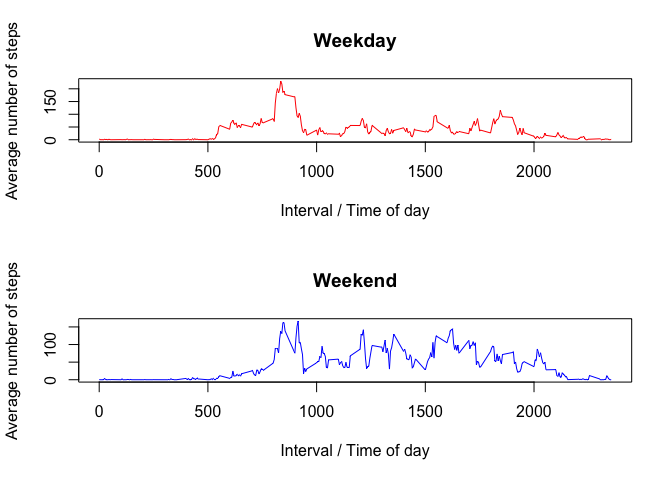

## Loading and preprocessing the data

```r
if (!(file.exists("activity.csv"))) { #unzips activity.csv file if it hasn't been yet
      unzip("activity.zip")
}

activityData <- read.csv("activity.csv")
```


## What is the mean total number of steps taken per day?
Before calculating the mean number of steps taken per day, let's look at a histogram of the number of 
steps taken per day to get a sense of the distribution of the data.

```r
indices <- !is.na(activityData$steps) #logical for rows where number of steps aren't NA
stepsEachDay <- tapply(activityData$steps[indices], activityData$date[indices], sum)

hist(stepsEachDay, breaks = floor(length(stepsEachDay) / 2), col = "red", 
     xlab = "", main = "Total number of steps taken each day")
```

<!-- -->

Mean number of steps taken per day:

```r
meanStepsPerDay <- round(mean(stepsEachDay), digits = 0)
meanStepsPerDay
```

```
## [1] 10766
```

Median number of steps taken per day:

```r
medianStepsPerDay <- median(stepsEachDay)
medianStepsPerDay
```

```
## [1] 10765
```


## What is the average daily activity pattern?

```r
stepAveragesAtIntervals <- tapply(activityData$steps[indices], activityData$interval[indices], mean)
plot(names(stepAveragesAtIntervals), stepAveragesAtIntervals, type = "l",
     xlab = "Interval / Time of day", ylab = "Average number of steps")
text(1200, stepAveragesAtIntervals["1200"] * 1.6, labels = "Noon")

intervalAtMax <- as.integer(names(which.max(stepAveragesAtIntervals))) #interval with maximum average number of steps
points(intervalAtMax, max(stepAveragesAtIntervals), col = "red", pch = 19)
text(intervalAtMax -95, max(stepAveragesAtIntervals) - 16, col = "red", cex = .8, srt = 70, 
     labels = paste0("MAX: [", intervalAtMax, "]"))
```

<!-- -->

Which 5-minute interval, on average across all the days in the dataset, contains the maximum number of steps?


```r
intervalAtMax
```

```
## [1] 835
```


## Imputing missing values
Calculate and report the total number of missing values in the dataset.

```r
sum(!indices)
```

```
## [1] 2304
```

Instead of removing all rows in the data set with missing values for steps, it might be better to impute those missing values. 
One method, which I will employ, is to replace all NA values with the mean number of steps for that given interval.


```r
imputed <- activityData
imputed[!indices,1] <- stepAveragesAtIntervals[as.character(imputed[!indices,3])]
```

Let's look at a histogram of the number of steps taken per day with the imputed data.

```r
stepsEachDay2 <- tapply(imputed$steps, imputed$date, sum)
hist(stepsEachDay2, breaks = floor(length(stepsEachDay2) / 2), col = "red", 
     xlab = "", main = "Total number of steps taken each day (from imputed data)")
```

<!-- -->

Mean number of steps taken per day in imputed data: 

```r
round(mean(stepsEachDay2), digits = 0)
```

```
## [1] 10766
```

Median number of steps taken per day in imputed data: 

```r
median(stepsEachDay2)
```

```
## [1] 10766.19
```
The results show that imputing the missing data with the average number of steps for the given interval largely preserves 
the mean and median. Since we're adding steps that weren't there in the original data, the total number of steps
taken each day is larger in the imputed data.


## Are there differences in activity patterns between weekdays and weekends?
Create a new factor variable in the dataset with two levels – “weekday” and “weekend” indicating whether a given date is a weekday or weekend day.

```r
weekdays <- factor(!(weekdays(as.Date(imputed$date, format = "%Y-%m-%d")) %in% c("Saturday", "Sunday")))
levels(weekdays) <- c("weekend", "weekday")
imputed <- cbind(imputed, weekdays)
```

Make a panel plot containing a time series plot of the 5-minute interval (x-axis) and the average number of steps taken, averaged across all weekday days or weekend days (y-axis).

```r
weekdayData <- subset(imputed, weekdays == "weekday")
weekendData <- subset(imputed, weekdays == "weekend")

weekdayAverages <- tapply(weekdayData$steps, weekdayData$interval, mean)
weekendAverages <- tapply(weekendData$steps, weekendData$interval, mean)

par(mfrow = c(2,1))

plot(names(weekdayAverages), weekdayAverages, type = "l", col = "red", 
     xlab = "Interval / Time of day", ylab = "Average number of steps", main = "Weekday")

plot(names(weekendAverages), weekendAverages, type = "l", col = "blue", 
     xlab = "Interval / Time of day", ylab = "Average number of steps", main = "Weekend")
```

<!-- -->


